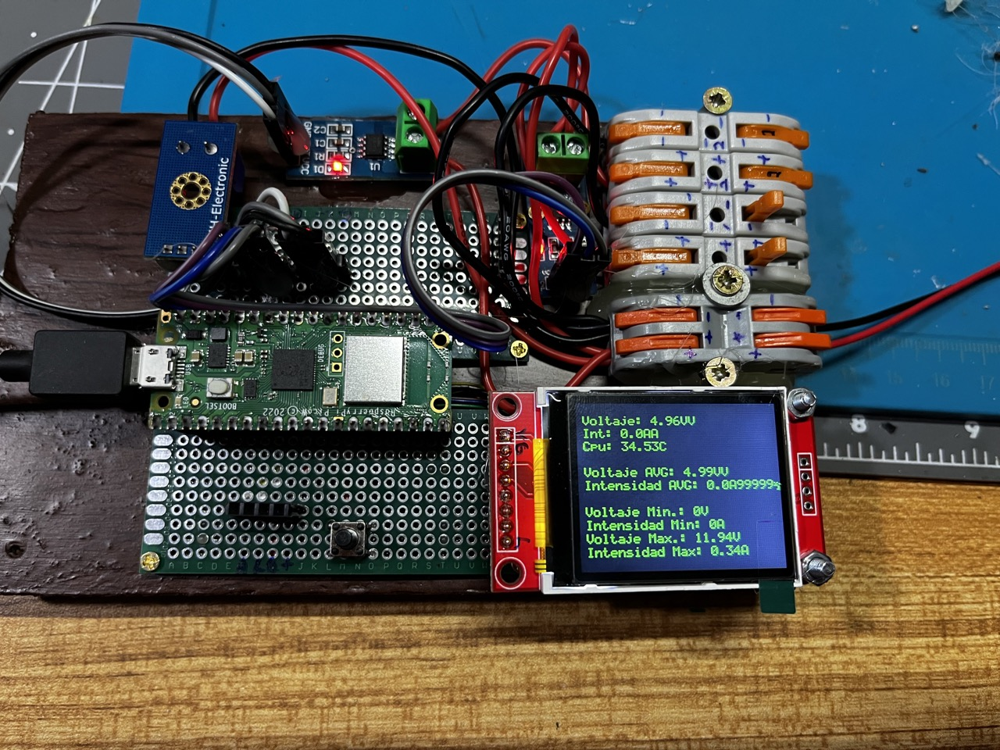

# Raspberry Pi Pico - Energy Monitor

Repository [https://gitlab.com/raupulus/rpi-pico-energy-monitor](https://gitlab.com/raupulus/rpi-pico-energy-monitor)

Sitio web del autor: [https://raupulus.dev](https://raupulus.dev)

## Description

Este software lee la intensidad y el voltaje de las entradas ADC, el siguiente paso es conectarse a la red inalámbrica y cargar datos a la API.

---

This software read intensity and voltage from ADC inputs, next step connect to wireless and upload data to api.

## Installation

Copie todos los archivos en raspberry pi pico, por ejemplo con el software thonny.

---

Copy all files in raspberry pi pico, for example with thonny software.

## Contributing

Envía PR o contacta conmigo en Gitlab: [https://gitlab.com/raupulus/rpi-pico-energy-monitor](https://gitlab.com/fryntiz/rpi-pico-energy-monitor)

---

Send PR or contact with me on Gitlab: [https://gitlab.com/raupulus/rpi-pico-energy-monitor](https://gitlab.com/fryntiz/rpi-pico-energy-monitor)

## Authors and acknowledgment

- Author: [Raúl Caro Pastorino](https://fryntiz.es)
- Display library from AnthonyKNorman in repository: [https://github.com/AnthonyKNorman/MicroPython_ST7735](https://github.com/AnthonyKNorman/MicroPython_ST7735)

## License

Proyecto de código abierto, licencia GPLv3.

---

Open source project, GPLv3 license.

## Project status

Liberación beta inicial, versión estable en proceso.

---

Initial beta Realease, stable versión work in progress.

## Pinout and hardware details

### Display ST7735 1.8 SPI 128x160

| Name      | Pin  | Details                                                     |
| --------- | ---- | ----------------------------------------------------------- |
| VLED      | 3,3v | Power for display backlight                                 |
| SCK(CLK)  | 10   | SPI Clock                                                   |
| SDA(MOSI) | 11   | (Tiene que estar conectado a RX)                            |
| A0(DC)    | 12   | Data/Command select                                         |
| RST       |  9   | Reset                                                       |
| CS        | 13   | Chip Select                                                 |
| GND       | GND  | Ground -                                                    |
| VCC       | 5v   | Power + (Según datasheet, debería funcionar a 3,3v también) |

### Intensity sensor one and two, type ACS712

Este sensor, cuando no tiene consumo para medir dará la mitad de la tensión de entrada (si entran 5v, saldrá 2,5v por lo que esa tensión equivale a 0 consumo y 5v equivale al máximo del sensor: 5/20/30).

Ejemplo:

Analog out min voltage = 2,5v (Equivale a 0A)
Analog out max voltage = 5v (Equivale a 30A)

Sensibilidad:

| Type | Sensitivity |
| ---- | ----------- |
| 5A   | 185mV/A     |
| 20A  | 100mV/A     |
| 30A  | 66mV/A      |

| Name | Pin           | Details    |
| ---- | ------------- | ---------- |
| VCC  | 5v/3.3v       | Power +    |
| GND  | GND           | Ground -   |
| AO   | I1=27 y I2=26 | Analog out |

### Voltage sensor one, type FZ0430

| Name | Pin                                                                                | Details    |
| ---- | ---------------------------------------------------------------------------------- | ---------- |
| VCC  | 3,3V (Ejemplos con 5v, al ser divisor de tensión debería funcionar con 3,3v igual) |            |
| GND  | GND                                                                                | Ground -   |
| AO   | GPIO28                                                                             | Analog out |

### Button for display power on

| Name | Pin | Details                   |
| ---- | --- | ------------------------- |
| GPIO | 7   | Only for power on display |

### Expansion connector i2c to four ADC (currently not used)

| Name | Pin | Details |
| ---- | --- | ------- |
| SDA  | 4   | I2C     |
| SDC  | 5   | I2C     |

### ADS1115 4 channel ADC (Conversor Analógico Digital mediante i2c con 4 canales)

| Name | Pin | Details |
| ---- | --- | ------- |
| SDA  | 4   | I2C     |
| SDC  | 5   | I2C     |

Para el uso de este conversor, estamos utilizando la librería de Robert-hh en su repositorio: [https://github.com/robert-hh/ads1x15](https://github.com/robert-hh/ads1x15)

Se encuentra en el proyecto dentro en Library/Ads1x15.py.

## MAX471 sensor

Voltaje máximo (Vin): 25V DC (Vref=5V)
Voltaje máximo (Vin): 16.5V DC (Vref=3.3V)
Corriente máxima: 3A

RS- Pin which is the negative side of the sensing resistor
GND Pin
SIGN Pin the sign pin will actually tell which way the current is flowing. In battery-powered operation, it actually gives us an indication of discharge and charging feature.
OUT Pin this is the voltage output pin, so we will get a voltage output of one volt per amp and we can feed that into an analog to digital converter on our Arduino Uno or Arduino Nano and we could actually calculate the current through a load. So it is very simple, the voltage out is actually the current through the load.
GND pin is the same as the other ground pin and finally
RS+ Pin which is the positive side of the sensing resistor.
